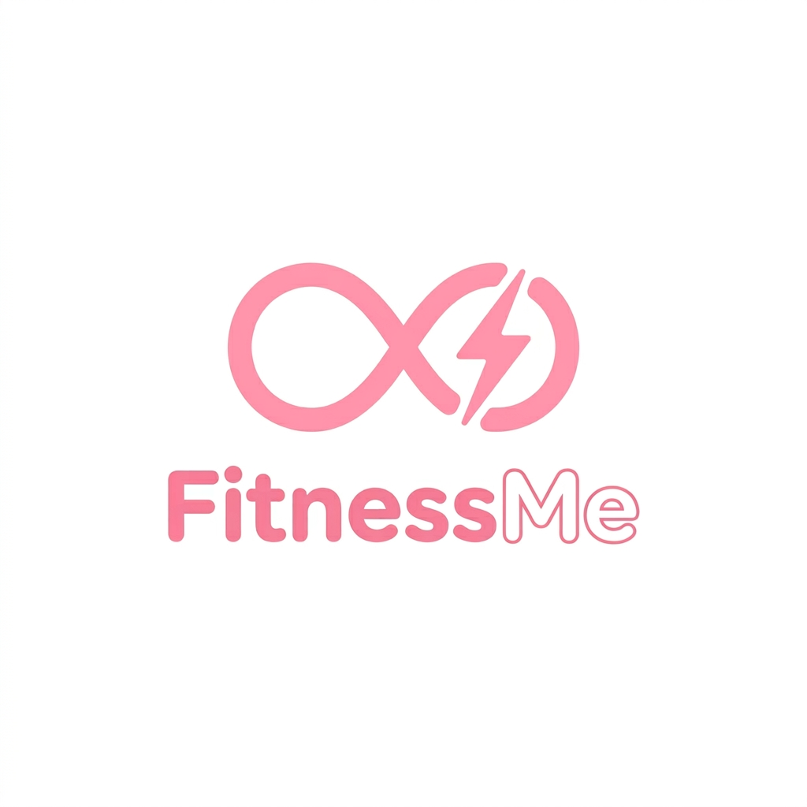
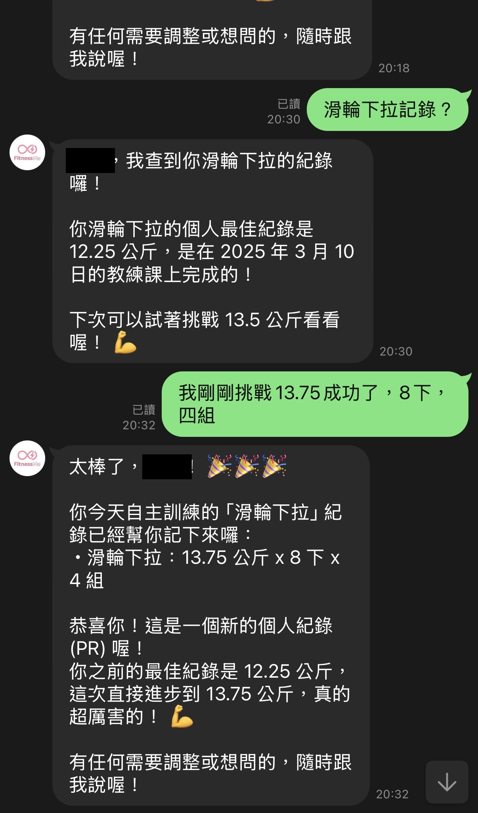
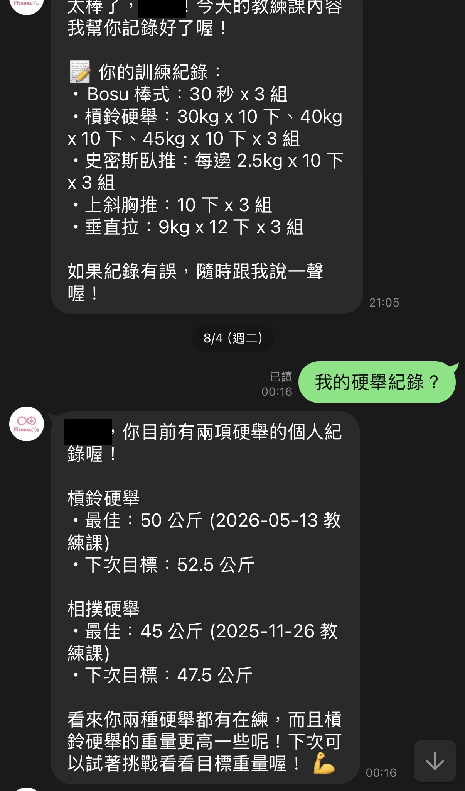
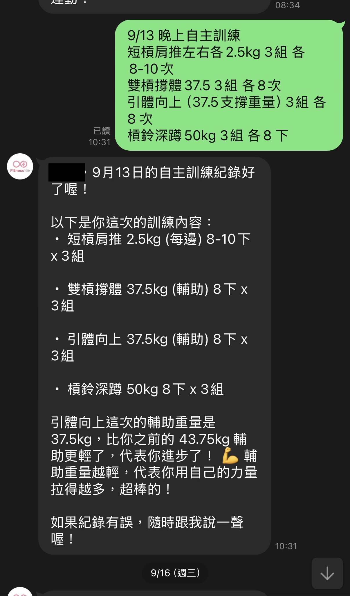
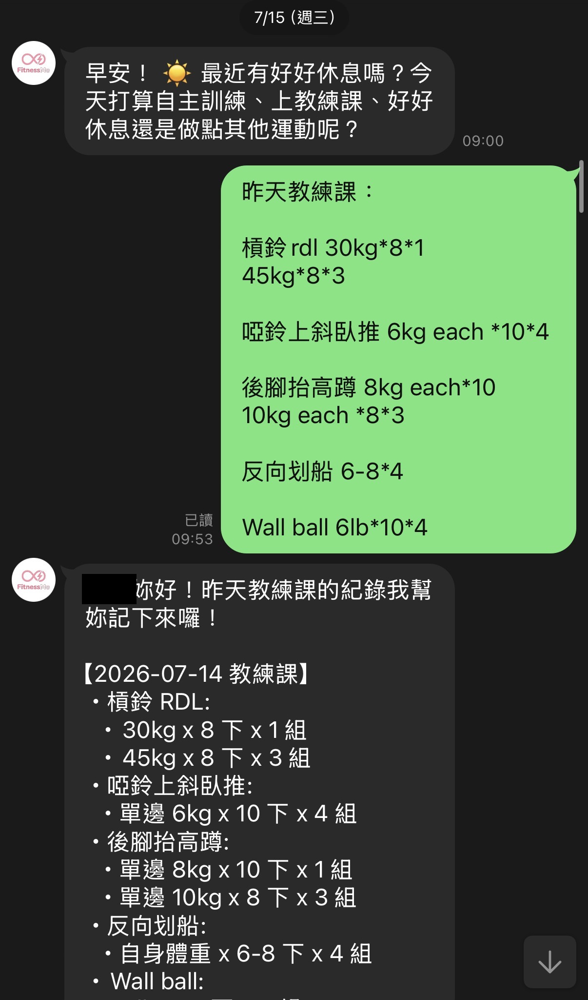
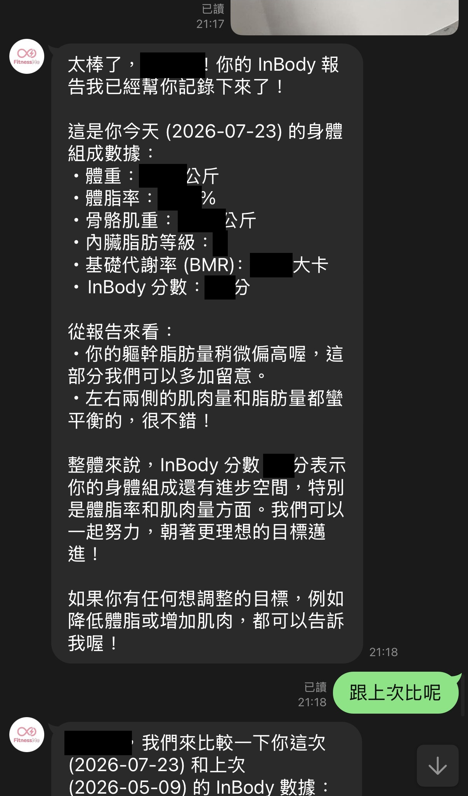
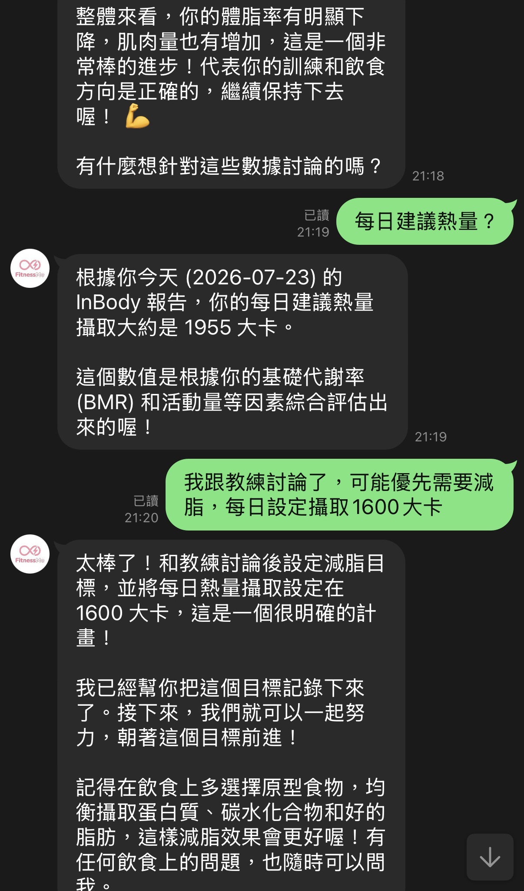
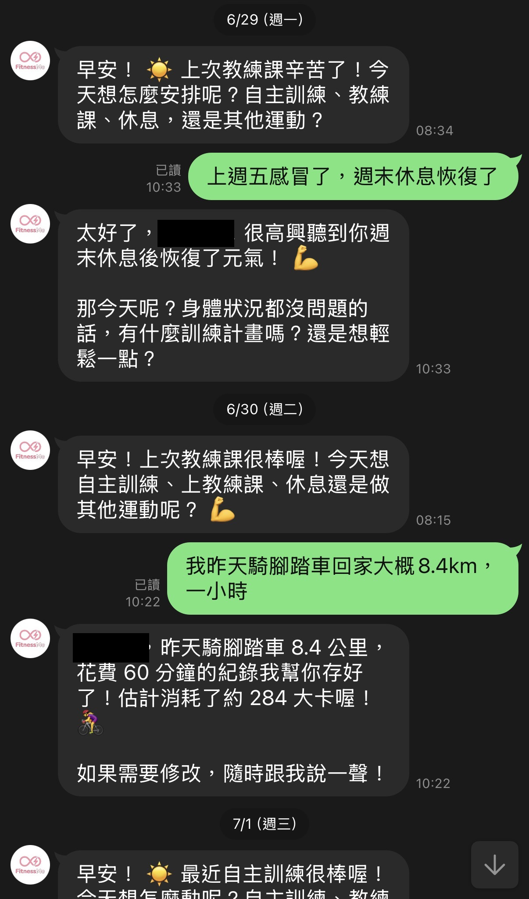
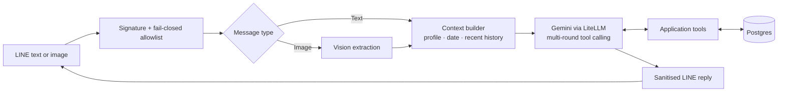
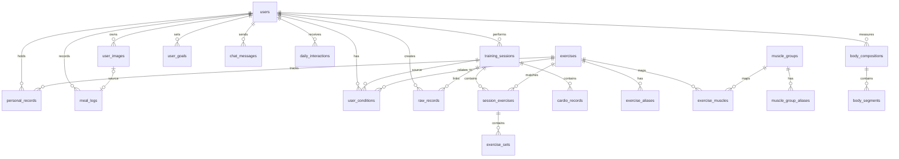

<p align="center">
  
</p>

# FitnessMe

A personal AI fitness companion on LINE, built around two needs: keeping
exercise going without added pressure, and making progress easier to see.
It combines gentle morning check-ins with conversational workout logging,
record lookup, and feedback on training and InBody reports.

[In use](#in-use) · [Architecture](#architecture) · [Quick start](#quick-start) · [Appendix](#appendix)

## Why I built it

I wanted to keep exercising, but often lacked a clear plan when I had time
to train, or a clear sense of whether I was making progress. I wanted a daily
nudge, timely feedback, and suggestions—without making a missed workout feel
like a failed check-in.

My coach recorded our sessions in the gym's app. My own workouts went into
phone notes whenever I remembered; InBody reports were photos in my camera
roll. To compare sessions or measurements, I had to find the right records,
interpret the shorthand, and piece the picture together myself. Having some
records did not make progress easy to see.

FitnessMe brings those records into the same conversation as today's plans.
A morning check-in makes room for training or rest. When I want to exercise,
I can ask for suggestions informed by recent training and goals, look up
earlier results, and log what I did. The model interprets text and photos;
application tools store and retrieve the underlying records. I built and
operate it for my own use; the interactions below are from that ongoing use.

## In use

The screenshots preserve the original chat viewport, with names and actual
InBody measurements redacted. Some messages continue beyond the frame.
Click an image to enlarge it.

### Pick up where the last workout left off

The left-hand screenshot shows a complete lookup-to-recording exchange:

1. **Look up a starting point.** I ask “滑輪下拉記錄？” (“My lat-pulldown record?”).
   The reply gives my personal record (PR) of **12.25 kg**, achieved on
   **2025-03-10**, and a next-weight reference of **13.5 kg**.
2. **Report what I actually did.** I follow up with “我剛剛挑戰 13.75 成功了，8下，四組”
   (“I just managed 13.75, eight reps, four sets”), without repeating the
   exercise name or filling out a form.
3. **See the result.** The bot replies with a saved-workout summary of
   **13.75 kg × 8 reps × 4 sets** and reports a new PR. I can check the summary,
   and the stored result is available for future queries.

The 13.5 kg reference comes from a fixed increment rule, not an assessment
of what is safe for me to lift. The recorded result is the **13.75 kg I report**,
not the suggested target.

The right-hand screenshot shows a related lookup: “My deadlift records?”
returns barbell and sumo deadlifts with separate dates and targets, without
requiring each exercise's stored name.

| Look up a PR, then record the next one | Find related exercise records |
| --- | --- |
| [](assets/linebot/sample-4.jpg) | [](assets/linebot/sample-5.jpg) |

In the current implementation, recent conversation supplies the exercise
context; `query_personal_records` retrieves stored PRs, and
`log_strength_training` writes the reported workout to Supabase Postgres.
The model interprets the follow-up; application code compares weights and
updates the PR. Records are written before I review the reply, so this is a
post-write check, not an approval gate. See [Architecture](#architecture) and
[Engineering notes](#engineering-notes) for the surrounding flow and safeguards.

### Keep the notes in your own words

Those records start with the same shorthand I used in my phone notes:
Chinese exercise names, `rdl`, `6kg each*10*4`, and different weights on
successive lines. “Yesterday's coach session” supplies the date and session
type without a separate form. The reply lays out what was recorded so I can
check it afterward.

The self-directed session also shows a less obvious rule: on an assisted
pull-up, a lower number means less assistance, not a weaker lift. The model
interprets the note; code handles that distinction when comparing PRs.

| Self-directed workout | Coach session |
| --- | --- |
| [](assets/linebot/sample-2.jpg) | [](assets/linebot/sample-3.jpg) |

### Start with a photo, then continue the conversation

I send a photo of an InBody report. After the bot extracts and records the
measurements, I ask, “How does it compare with the last one?” The first screenshot
keeps the photo message's lower edge and the start of that follow-up; the
second picks up after the comparison, as the conversation turns to goals.

The next exchange shows a different kind of follow-up. After asking about
daily calories, I bring in a target discussed with my coach. The bot records
that choice as a goal for future conversations—the model's suggestion is
not the final decision.

| Record an InBody report | Record the goal I choose |
| --- | --- |
| [](assets/linebot/sample-6.jpg) | [](assets/linebot/sample-7.jpg) |

### Make room for exercise—and rest

A morning check-in brings the conversation back to today's plans: train on
my own, see my coach, rest, or do something else. In this excerpt, my reply
also becomes a record of yesterday's bike ride. Recent training and active
conditions provide context; each exchange does not have to start from zero.

The point is to help me decide, not require a workout. Rest is a valid plan,
and I choose whether to act on the suggestions.

[](assets/linebot/sample-1.jpg)

This is a personal tool, not a medical or certified coaching service. I review
extracted values and suggestions; records are written before that review,
not held behind an approval step.

## Architecture



The model interprets text and images, selects tools, and produces summaries
and suggestions. Tools read and write the user's structured records; code
calculates PRs and next weight targets, scopes data access, skips existing
training dates during historical imports, and applies retention policies.
Relative dates are interpreted by the model using an explicit current-date
and timezone context, then parsed by the application. Advice and extracted
values remain model outputs that the user needs to review.

## Engineering notes

The conversational interface is flexible; the rules underneath it are more
deliberate. These are the main choices behind the interactions above:

- **Stack:** Python 3.12, FastAPI, SQLAlchemy async, LiteLLM, Gemini, LINE Messaging API, Supabase Postgres/Storage, Docker, and GitHub Actions.
- **Fitness-specific data rules:** [workout services](src/services/workout.py) retain set groups, weight units, per-side loads, and session types. PR comparisons normalise weights and treat lower assistance as progress on assisted exercises; next weight targets follow a fixed increment rule.
- **Queries across turns and tools:** [the message handler](src/line/handler.py) supplies recent conversation history, so a follow-up can omit an exercise name, and allows up to three tool-calling rounds. SQL searches over exercise names, aliases, and muscle groups let the model look up related variants before querying their records, without adding a vector database for this structured catalogue.
- **Context from stored state:** [prompt assembly](src/llm/prompts.py) includes the current date, profile, active goals, and pending daily interaction. Image-specific instructions are included when an image is being processed.
- **Reliability from real failures:** missed records, date confusion, and empty replies led to broader search, explicit date context, retry tiers, and rule-based fallbacks. [Regression tests](tests/) cover assisted PRs, historical dates, multi-round tool calls, empty responses, and tool-syntax leakage into chat.
- **Access and data lifecycle:** the LINE allowlist is fail-closed, and data tools receive the authenticated `user_id`. Chat history is retained for 7 days; raw inputs and daily interactions for 90 days. Photos live behind a storage interface, with metadata and storage keys in Postgres.
- **Delivery and operation:** [GitHub Actions](.github/workflows/deploy.yml) runs tests before building and deploying the Docker image. The appendix documents the schema, Admin API, VM setup, and routine operations.

## Quick start

### Prerequisites

- Python 3.12
- [uv](https://docs.astral.sh/uv/)
- A LINE Messaging API channel and an LLM provider key for a working bot

### Run locally

```bash
uv sync
cp .env.example .env
# Fill in only the values needed for your local setup.
uv run uvicorn src.main:app --reload
```

The default development database is SQLite. The app creates tables and seeds
the exercise catalogue at startup. See [`.env.example`](.env.example) for all
configuration variables.

### Run tests

```bash
uv run pytest
```

### Useful commands

```bash
# Seed the exercise catalogue manually (normally done at startup).
uv run python -m scripts.seed

# Import a local history file after configuring an authorised LINE user.
uv run python -m scripts.import_history <LINE_USER_ID>
```

Historical-import input must follow
[`docs/import-template.txt`](docs/import-template.txt). Private source records,
unredacted photos, databases, and environment files are excluded from version
control; the reviewed README screenshots live in `assets/linebot/`.

## Repository layout

```text
src/
  auth/       LINE identity and allowlist checks
  db/         SQLAlchemy models and database setup
  line/       webhook and push-message integration
  llm/        prompts, model client, tools, and output sanitisation
  services/   workout, profile, image, scheduling, and admin workflows
  storage/    local and Supabase storage adapters
tests/        unit and integration-style tests
deploy/       Docker Compose and Caddy configuration
assets/       README visual assets
  favicon.png FitnessMe logo
  linebot/    redacted LINE workflow screenshots
docs/         import-file template
```

## Deployment

The production setup uses Docker Compose with Caddy, Supabase, and GitHub
Actions. The workflow runs tests, builds an image, deploys it to a configured
host, and injects runtime configuration from GitHub Actions secrets. Do not
commit `.env`, databases, private exported records, or unredacted images.

## Appendix

<details>
<summary><strong>Data model</strong></summary>

The source of truth is [`src/db/models.py`](src/db/models.py). The database has
20 tables across identity, user state, training, body composition, interaction
logs, and the seeded exercise dictionary.



- `training_sessions` → `session_exercises` → `exercise_sets` captures a
  workout without flattening weight progressions.
- `personal_records` caches normalised best weights so PR replies do not need
  to recompute every historical set.
- `exercise_muscles` is the explicit many-to-many junction between exercises
  and muscle groups; `muscle_group_aliases` supports fuzzy muscle queries.
- Image bytes are stored outside Postgres; `user_images` retains only metadata
  and a storage key.
- Event dates represent the actual training or measurement day, rather than
  upload time.
- `raw_records`, `chat_messages`, and `daily_interactions` use different
  retention periods.

</details>

<details>
<summary><strong>Admin API</strong></summary>

Both endpoints require `X-API-Key` using `ADMIN_API_KEY`.

| Method | Path | Purpose |
| --- | --- | --- |
| `POST` | `/admin/import-history` | Import dated free-form records for one authorised LINE user. Returns `202` and processes in the background. |
| `POST` | `/admin/delete-records` | Delete training, cardio, body-composition, meal, and PR data in an inclusive date range. |

The history importer is idempotent per user and training date. Its file format
is documented in [`docs/import-template.txt`](docs/import-template.txt).

```bash
curl -X POST https://your-server.com/admin/import-history \
  -H "X-API-Key: $ADMIN_API_KEY" \
  -F "line_user_id=U..." \
  -F "file=@records.txt"

curl -X POST https://your-server.com/admin/delete-records \
  -H "X-API-Key: $ADMIN_API_KEY" \
  -H "Content-Type: application/json" \
  -d '{"line_user_id":"U...","start_date":"2025-05-12","end_date":"2025-05-14"}'
```

</details>

<details>
<summary><strong>Deployment and operations</strong></summary>

**Target stack:** GCP e2-micro, Docker Compose, Caddy, Supabase Postgres and
Storage, plus GitHub Actions. A push to `main` runs tests, builds and pushes an
image to GHCR, transfers Compose/Caddy configuration, writes runtime settings
from GitHub Actions secrets, then runs `docker compose pull && docker compose up -d`.

### One-time host bootstrap

On a new Ubuntu VM, install Docker Compose, add a 2 GB swap file (the e2-micro
has 1 GB RAM), and create the deployment directory:

```bash
sudo fallocate -l 2G /swapfile
sudo chmod 600 /swapfile && sudo mkswap /swapfile && sudo swapon /swapfile
echo '/swapfile none swap sw 0 0' | sudo tee -a /etc/fstab

# Install Docker Engine from Docker's official apt repository.
sudo apt update
sudo apt install -y ca-certificates curl
sudo install -m 0755 -d /etc/apt/keyrings
sudo curl -fsSL https://download.docker.com/linux/ubuntu/gpg -o /etc/apt/keyrings/docker.asc
sudo chmod a+r /etc/apt/keyrings/docker.asc
sudo tee /etc/apt/sources.list.d/docker.sources >/dev/null <<EOF
Types: deb
URIs: https://download.docker.com/linux/ubuntu
Suites: $(. /etc/os-release && echo "${UBUNTU_CODENAME:-$VERSION_CODENAME}")
Components: stable
Architectures: $(dpkg --print-architecture)
Signed-By: /etc/apt/keyrings/docker.asc
EOF

sudo apt update
sudo apt install -y docker-ce docker-ce-cli containerd.io docker-buildx-plugin docker-compose-plugin
sudo usermod -aG docker $USER  # Log out and back in before using Docker without sudo.
mkdir -p ~/fitness-me
```

Create a dedicated SSH key for GitHub Actions and add its public half to
`~/.ssh/authorized_keys`. Store the private half only in the `VM_SSH_KEY`
repository secret.

### Required GitHub Actions secrets

`VM_HOST`, `VM_USER`, `VM_SSH_KEY`, `LINE_CHANNEL_SECRET`,
`LINE_CHANNEL_ACCESS_TOKEN`, `LLM_PROVIDER`, `LLM_API_KEY`, `LLM_MODEL`,
`DATABASE_URL`, `STORAGE_PROVIDER`, `SUPABASE_URL`, `SUPABASE_SERVICE_KEY`,
`SUPABASE_BUCKET`, `ALLOWED_USER_IDS`, `ADMIN_API_KEY`, `ADMIN_LINE_USER_ID`,
`BASE_URL`, `TIMEZONE`, and `DOMAIN`.

`ALLOWED_USER_IDS` is intentionally fail-closed: an empty value allows no one
to invoke the bot. Use a stable hostname and point the LINE webhook at
`https://<your-domain>/webhook` after the first successful deployment.

### Day-2 operations

| Task | Command or action |
| --- | --- |
| Ship a change | Push to `main`. |
| Rotate a secret | Update the GitHub Action secret, then re-run the workflow. |
| Tail application logs | `ssh <vm> 'docker compose -f ~/fitness-me/docker-compose.yml logs -f app'` |
| Tail proxy logs | Use the same command with `caddy` in place of `app`. |
| Rebuild a VM | Repeat host bootstrap, update `VM_HOST` if needed, then re-run the workflow. |

</details>

## License

Source is available for viewing and evaluation only. See [LICENSE](LICENSE).
