# Fitness-Me

Personal fitness LINE Bot powered by LLM. Tracks workouts, detects PRs, and gives training suggestions.

## 產品概觀

一支整合在 LINE 裡的個人訓練助手。把「訓練日記、教練建議、體組成追蹤」三件事用聊天訊息收斂進同一個入口，免填表、免開 app、免用 spreadsheet。

### 解決的痛點
- 寫訓練日記要打字太麻煩，用 app 表單填得很慢
- 想追蹤 PR（個人最佳重量）但人腦記不住
- InBody 報告每次都要手 key 數字進 Excel
- 有教練的時候沒問題，自己練的時候不知道該練什麼

### 核心能力

| 能力 | 怎麼運作 |
|------|---------|
| **訓練紀錄** | 直接打「深蹲 40kg*10*4」，LLM 解析後寫進 DB 並回覆確認 |
| **PR 自動偵測** | 重量破紀錄時自動標記、慶祝、推算下次目標（含助力器材的反向邏輯）|
| **InBody 拍照入庫** | 傳 InBody 報告照片 → 視覺模型 OCR → 自動寫入體脂、骨骼肌、各部位數據 |
| **飲食紀錄** | 傳便當照（或文字描述）→ 視覺模型估算餐點/熱量/巨量營養素 → 寫入結構化紀錄，可查每日總熱量 |
| **訓練表入庫** | 拍紙本訓練單 → 視覺模型解析動作/組數/重量 → 走跟手打文字一樣的 `log_strength_training` 流程 |
| **每日推播** | 早上 8 點推「今天有什麼計畫？」根據回覆給對應建議 |
| **訓練推薦** | 自主訓練時，LLM 參考近 7 天訓練、身體狀況、目標，避開 48 小時內練過的肌群 |
| **隨時查詢** | 「我上週練了什麼？」「最大深蹲？」「體脂趨勢？」「給我看上次 InBody」全用聊天問 |
| **目標追蹤** | 設「6 月底前體脂 <20%」這類有期限的目標，達成時自動慶祝 |
| **狀況觀察** | LLM 從訓練紀錄挖出姿勢/弱點/動作提示（如「左骨盆高、右臀無力」），之後給推薦時自動納入 |

### 典型互動

**每天早上**
```
Bot: 早安！今天有什麼計畫？
You: 自己練
Bot: [參考近期訓練 + 目前條件 + 目標] 建議今天練上肢推：胸+前三角+三頭...
```

**訓練當下**
```
You: 後腳抬高蹲 空*10 / 6kg each*10 / 8kg each*8*3
Bot: 已記錄！後腳抬高蹲（PR! 前次 6kg each）
     - 空槓 x 10
     - 6kg each x 10
     - 8kg each x 8 x 3
```

**量完 InBody**
```
You: [傳一張 InBody 報告照]
Bot: 已記錄你 4/22 的 InBody：
     體脂 22.5%（比上次 -1.5%）、骨骼肌 24.5kg
     左右臂肌肉量略不平衡，建議多做右側單邊動作
     離目標體脂 20% 還差 2.5 個百分點
```

**隨時查詢**
```
You: 我上次深蹲多重？
Bot: 你的槓鈴背蹲 PR 是 50kg（2026-04-15），下個目標 52.5kg
```

整體價值：把「教練不在旁邊」的時段補起來——記得住數字、認得出進步、看得懂 InBody、知道接下來該練什麼。

## Setup

```bash
uv sync
cp .env.example .env
# Edit .env with your credentials
```

## Run

```bash
uv run uvicorn src.main:app --reload
```

## One-Time Scripts

### Seed exercise database

Populates exercises, aliases, and muscle groups. Runs automatically on app startup, but can also be run manually:

```bash
uv run python -m scripts.seed
```

### Import historical records (local)

```bash
uv run python -m scripts.import_history <LINE_USER_ID>
```

Parses `specs/spec-001/raw-fitness-record` using LLM. Seeds exercise DB first if needed.

## Database Schema

Authoritative source: `src/db/models.py`. This diagram is hand-maintained — ask Claude to redraw it after schema changes.

### Conceptual groups

19 tables, 7 groups. Each group has a single responsibility — splits within a group are driven by either nested cardinality or different retention rules.

**Identity** (1)
- `users` — LINE identity plus soft fitness-profile fields (cadence, cardio status, target body fat / max HR).

**State & goals about the user** (3)
- `user_conditions` — body issues / cues the LLM extracts from training logs (posture, weakness, injury). Can be `resolved`.
- `user_goals` — concrete deadlined goals (`body fat <20% by 2026-06-01`).
- `user_images` — uploaded photos (InBody reports, meal photos, training sheets, progress shots, other); the bytes live in the Storage backend, this row is the index. `date` is the actual measurement / capture day (vision model OCRs it off InBody printouts and training sheets), **not** the upload day.

**Training records** (4, nested)
- `training_sessions` — one workout (date, self/coach).
  - `session_exercises` — exercises done that session.
    - `exercise_sets` — set rows (weight × reps × num_sets). One exercise can have several rows when weight progresses (e.g. `空槓*10 / 6kg*10 / 8kg*8*3`).
  - `cardio_records` — cardio entries; structurally too different from strength sets to share a table.

**PR cache** (1)
- `personal_records` — best-ever weight per (user, exercise). Could be derived from `exercise_sets`, but cached so we don't recompute (and re-normalise per_side / counterweight) on every reply.

**Body & nutrition** (3)
- `body_compositions` — one measurement (body fat, weight, muscle mass, BMR, score). Aligns to `user_images` for the same InBody report **only via shared `(user_id, date)`** — no FK. Both rows carry the actual measurement date, so the join works even when the photo is uploaded days later.
- `body_segments` — the 5 InBody body-part rows hanging off a measurement; split out so a measurement isn't 20 columns wide.
- `meal_logs` — one meal entry (date + meal_type, food list, optional calorie/macro estimates). Has an explicit nullable FK to `user_images` because there can be multiple meals per day, so date alignment alone wouldn't disambiguate. Source of truth — works without a photo.

**Interaction logs** (3, different retention)
- `raw_records` — permanent audit log of messages that triggered a DB write (90 days).
- `chat_messages` — short-term LLM context (7 days).
- `daily_interactions` — daily push state machine: sent → user replied → bot suggested (90 days).

**Exercise dictionary** (4, all seed data)
- `exercises` — canonical movement (Barbell Back Squat, RDL, ...).
- `exercise_aliases` — user shorthand → canonical (`深蹲` / `rdl` / `羅馬尼亞硬舉`).
- `muscle_groups` — muscle taxonomy.
- `exercise_muscles` — many-to-many between exercises and muscle groups (primary / secondary).

The remaining sections of this page (diagram + column tables) zoom into the relationships and fields.

```mermaid
erDiagram
    users ||--o{ user_conditions : has
    users ||--o{ user_goals : has
    users ||--o{ user_images : owns
    users ||--o{ raw_records : logs
    users ||--o{ training_sessions : performs
    users ||--o{ personal_records : holds
    users ||--o{ body_compositions : measures
    users ||--o{ daily_interactions : receives
    users ||--o{ chat_messages : sends

    training_sessions ||--o{ session_exercises : contains
    training_sessions ||--o{ cardio_records : contains
    training_sessions ||--o{ raw_records : "linked"
    session_exercises ||--o{ exercise_sets : "weight progressions"

    exercises ||--o{ session_exercises : "matched as"
    exercises ||--o{ exercise_aliases : "known as"
    exercises ||--o{ personal_records : tracks
    exercises ||--o{ user_conditions : "cue for"
    exercises }o--o{ muscle_groups : "exercise_muscles"

    body_compositions ||--o{ body_segments : "InBody parts"

    users ||--o{ meal_logs : eats
    user_images ||--o| meal_logs : "optional photo"

    users {
        int id PK
        string line_user_id UK
        string display_name
        bool is_active
        bigint created_at
        text training_habit "fitness profile"
        text cardio_status
        float target_body_fat_pct
        int target_max_hr
        text notes
        bigint profile_updated_at
    }
    user_conditions {
        int id PK
        int user_id FK
        int exercise_id FK "nullable"
        string category "posture|injury|weakness|cue"
        text description
        text action_item
        bool is_active
        bigint created_at
        bigint resolved_at
    }
    user_goals {
        int id PK
        int user_id FK
        string category
        text description
        float target_value
        string target_unit
        bigint deadline
        string status
    }
    user_images {
        int id PK
        int user_id FK
        string category "inbody|meal|training_sheet|progress|other"
        string storage_key "Storage backend key"
        date date
        text description
    }
    raw_records {
        int id PK
        int user_id FK
        int session_id FK "nullable"
        string source "line_message|historical_import|manual"
        text content "raw user text"
        string record_type
    }
    training_sessions {
        int id PK
        int user_id FK
        date date
        string session_type "self_training|coach|other"
        text notes
        bigint recorded_at
    }
    session_exercises {
        int id PK
        int session_id FK
        int exercise_id FK "nullable"
        string exercise_name "preserved if unmatched"
        int order_num
        text raw_text
        string category "working|warmup|activation|circuit"
    }
    exercise_sets {
        int id PK
        int session_exercise_id FK
        float weight_value
        string weight_type "total|per_side|counterweight|bodyweight|band"
        string weight_unit
        string band_info
        int reps_min
        int reps_max
        int num_sets
        int duration_sec
        bool is_each_side
    }
    cardio_records {
        int id PK
        int session_id FK
        string cardio_type "treadmill|spinning|rowing"
        int duration_min
        float incline
        float speed_kmh
        float resistance
        int max_heart_rate
        int avg_heart_rate
    }
    personal_records {
        int id PK
        int user_id FK
        int exercise_id FK
        float best_weight_kg "normalized total kg"
        string weight_display
        date achieved_date
        float next_target_kg
    }
    body_compositions {
        int id PK
        int user_id FK
        date date
        float body_fat_pct
        float weight_kg
        float muscle_mass_kg
        int visceral_fat_level
        int bmr
        int score
    }
    body_segments {
        int id PK
        int body_composition_id FK
        string segment "left_arm|right_arm|trunk|left_leg|right_leg"
        float muscle_mass_kg
        string muscle_grade
        float fat_mass_kg
        string fat_grade
    }
    daily_interactions {
        int id PK
        int user_id FK
        date date
        bigint push_sent_at
        string user_plan "rest|self_training|coach|other"
        text user_response
        text bot_suggestion
        bigint responded_at
    }
    chat_messages {
        int id PK
        int user_id FK
        string role "user|assistant"
        text content
        bigint created_at
    }
    exercises {
        int id PK
        string name "canonical EN"
        string name_zh
        string type "strength|cardio|mobility|warmup"
        string equipment
        string movement_pattern
        bool is_assisted "lower weight = better"
    }
    exercise_aliases {
        int id PK
        int exercise_id FK
        string alias UK
    }
    muscle_groups {
        int id PK
        string name
        string name_zh
        string category "lower_body|upper_push|upper_pull|core"
    }
    meal_logs {
        int id PK
        int user_id FK
        date date
        string meal_type "breakfast|lunch|dinner|snack"
        text food_items "JSON array"
        int calories
        float protein_g
        float carbs_g
        float fat_g
        int image_id FK "nullable"
        bigint created_at
    }
```



Notes:
- All `*_at` columns are unix-epoch seconds (`BIGINT`) so they survive past 2038.
- `exercises`, `muscle_groups`, and `exercise_aliases` are seeded automatically on app startup; everything else is filled by the LINE bot at runtime.
- Fitness profile fields (`training_habit`, `cardio_status`, target metrics) live on `users` directly. Concrete, deadlined goals live in `user_goals` — the two are deliberately separate.
- All `date` columns mean the **actual event day** (training day, measurement day, capture day), never the upload / processing day. The LLM resolves verbal hints like "yesterday" / "上週二" before writing.

## Storage Backends

`STORAGE_PROVIDER` selects the image store:

- `local`    — writes to `data/images/`. Signed URLs route back through `/images/{key}/{token}` (HMAC).
- `supabase` — uploads to a Supabase Storage bucket. Signed URLs are minted by Supabase.

To swap, change `STORAGE_PROVIDER` and the Supabase env vars; no code changes required. Implementations live in `src/storage/{base,local,supabase}.py` behind a three-method `Storage` Protocol — adding S3 / R2 / GCS later means a fourth file, no churn elsewhere.

### Image flow

The Storage interface is touched from exactly three places:

1. **Upload** — `src/line/handler.py::handle_image_message` calls `storage.save(key, bytes)` after the vision model classifies the photo. The DB row in `user_images` only stores the key; bytes never live in Postgres.
2. **Mint URL** — when the LLM calls `query_user_images(include_urls=True)`, `src/services/images.py::get_image_url` calls `storage.signed_url(key)`. LocalStorage hands back a server-relative URL (HMAC-signed); SupabaseStorage hands back a Supabase-signed URL.
3. **Serve bytes** — only relevant for LocalStorage: `GET /images/{key_b64}/{token}` in `src/main.py` verifies the HMAC and returns the file. SupabaseStorage URLs hit Supabase's CDN directly and never touch this server.

Image keys are namespaced as `{line_user_id}/{category}/{message_id}.jpg` so a backend swap can rsync / migrate by prefix.

## Admin API

Requires `ADMIN_API_KEY` env var. All requests must include `X-API-Key` header.

### Import historical records (remote)

The endpoint returns **202 Accepted** immediately and runs the LLM parsing in the background. Records are written under the request-supplied `line_user_id` (the data owner); when the import finishes `ADMIN_LINE_USER_ID` (the operator) receives a LINE push notification with the success/skip counts (or a failure message).

File upload (recommended):

```bash
curl -X POST https://your-server.com/admin/import-history \
  -H "X-API-Key: $ADMIN_API_KEY" \
  -F "line_user_id=U..." \
  -F "file=@records.txt"
```

Or JSON body:

```bash
curl -X POST https://your-server.com/admin/import-history \
  -H "X-API-Key: $ADMIN_API_KEY" \
  -H "Content-Type: application/json" \
  -d '{"line_user_id": "U...", "raw_text": "..."}'
```

Records older than 2 years are automatically skipped (configurable via `cutoff_years`).

> Database backups are handled by Supabase (free tier: 7-day point-in-time recovery). For local SQLite dev there is no automated backup.

## Test

```bash
uv run pytest
```

## Deploy

Target stack: **GCP e2-micro (Always Free) + Docker Compose + Caddy** in front, **Supabase** for Postgres + Storage. CI/CD via GitHub Actions — every push to `main` builds an image, ships it to GHCR, and redeploys on the VM.

### One-time VM bootstrap

On a freshly-created Ubuntu e2-micro:

```bash
# 2 GB swap (1 GB RAM is tight for Docker + Python + Caddy)
sudo fallocate -l 2G /swapfile && sudo chmod 600 /swapfile
sudo mkswap /swapfile && sudo swapon /swapfile
echo '/swapfile none swap sw 0 0' | sudo tee -a /etc/fstab

# Docker
sudo install -m 0755 -d /etc/apt/keyrings
sudo curl -fsSL https://download.docker.com/linux/ubuntu/gpg -o /etc/apt/keyrings/docker.asc
sudo chmod a+r /etc/apt/keyrings/docker.asc
ARCH=$(dpkg --print-architecture)
CODENAME=$(. /etc/os-release && echo $VERSION_CODENAME)
echo "deb [arch=$ARCH signed-by=/etc/apt/keyrings/docker.asc] https://download.docker.com/linux/ubuntu $CODENAME stable" | sudo tee /etc/apt/sources.list.d/docker.list
sudo apt update
sudo apt install -y docker-ce docker-ce-cli containerd.io docker-buildx-plugin docker-compose-plugin
sudo usermod -aG docker $USER       # log out + back in for this to take effect

# Authenticate to GHCR (private image)
read -s GHCR_TOKEN                  # paste a PAT with read:packages scope
echo $GHCR_TOKEN | docker login ghcr.io -u <your-github-username> --password-stdin
unset GHCR_TOKEN

# SSH key the GitHub Actions deploy job will use to log back in
ssh-keygen -t ed25519 -f ~/.ssh/gha_deploy -N "" -C "github-actions-deploy"
cat ~/.ssh/gha_deploy.pub >> ~/.ssh/authorized_keys
chmod 600 ~/.ssh/authorized_keys
cat ~/.ssh/gha_deploy               # copy the entire private key for VM_SSH_KEY below

mkdir -p ~/fitness-me               # destination for docker-compose.yml + .env
```

### Hostname (no domain required)

This stack uses the public DNS shortcut **`<your-static-ip>.nip.io`** — `nip.io` deterministically resolves any IP-encoded subdomain to that IP, so a fresh GCP VM has an HTTPS-eligible hostname instantly. Caddy obtains a Let's Encrypt cert against it on first start.

### GitHub repo secrets

Set under **Settings → Secrets and variables → Actions**:

| Name | Source / value |
|------|----------------|
| `VM_HOST` | VM's static external IP |
| `VM_USER` | Linux user the deploy SSHes in as |
| `VM_SSH_KEY` | Private key from `cat ~/.ssh/gha_deploy` (full text, including BEGIN/END lines) |
| `LINE_CHANNEL_SECRET` | LINE Developers Console |
| `LINE_CHANNEL_ACCESS_TOKEN` | LINE Developers Console |
| `LLM_PROVIDER` | `gemini` |
| `LLM_API_KEY` | Google AI Studio |
| `LLM_MODEL` | `gemini/gemini-2.0-flash` |
| `DATABASE_URL` | Supabase Session Pooler URI, prefixed with `postgresql+asyncpg://` |
| `STORAGE_PROVIDER` | `supabase` |
| `SUPABASE_URL` | Supabase project URL |
| `SUPABASE_SERVICE_KEY` | Supabase service role key |
| `SUPABASE_BUCKET` | `fitness-images` |
| `ALLOWED_USER_IDS` | Your LINE user ID(s), comma-separated |
| `ADMIN_API_KEY` | `openssl rand -hex 32` |
| `ADMIN_LINE_USER_ID` | LINE user id (the operator) that receives admin notifications such as import-completion pushes. Required for `/admin/import-history`. |
| `BASE_URL` | `https://<ip>.nip.io` |
| `TIMEZONE` | `Asia/Taipei` |
| `DOMAIN` | `<ip>.nip.io` (Caddy uses this; no protocol prefix) |

### First deploy

Push to `main`. The workflow at `.github/workflows/deploy.yml`:

1. Runs `pytest`
2. Builds the Docker image and pushes `ghcr.io/<owner>/fitness-me:{latest,sha}`
3. SCPs `deploy/docker-compose.yml` + `deploy/Caddyfile` to `~/fitness-me/`
4. SSHes in, writes `.env` from secrets, runs `docker compose pull && docker compose up -d`

Caddy obtains the Let's Encrypt certificate on first start (~30 seconds). Then point LINE webhook to `https://<ip>.nip.io/webhook`.

### Day-2 ops

| Task | How |
|------|-----|
| Ship a code change | `git push` to `main` |
| Rotate a secret | Update GitHub secret, re-trigger workflow (or any push) |
| Rebuild VM from scratch | Re-run the bootstrap, set `VM_HOST` if IP changed, re-run workflow |
| Tail app logs | `ssh <vm> 'docker compose -f ~/fitness-me/docker-compose.yml logs -f app'` |
| Tail Caddy logs | same with `... logs -f caddy` |

The Supabase connection string **must** use the **Session Pooler** (port 5432 on the pooler hostname). Direct (5432) is IPv6-only on the free tier; Transaction Pooler (6543) breaks SQLAlchemy's prepared-statement cache.
