# Fitness-Me

Personal fitness LINE Bot powered by LLM. Tracks workouts, detects PRs, and gives training suggestions.

## Setup

```bash
uv sync
cp .env.example .env
# Edit .env with your credentials
```

## Run

```bash
uv run uvicorn src.main:app --reload
```

## One-Time Scripts

### Seed exercise database

Populates exercises, aliases, and muscle groups. Runs automatically on app startup, but can also be run manually:

```bash
uv run python -m scripts.seed
```

### Import historical records (local)

```bash
uv run python -m scripts.import_history <LINE_USER_ID>
```

Parses `specs/spec-001/raw-fitness-record` using LLM. Seeds exercise DB first if needed.

## Database Schema

Authoritative source: `src/db/models.py`. This diagram is hand-maintained — ask Claude to redraw it after schema changes.

```mermaid
erDiagram
    users ||--o| user_profile : "1:1"
    users ||--o{ user_conditions : has
    users ||--o{ user_goals : has
    users ||--o{ user_images : owns
    users ||--o{ raw_records : logs
    users ||--o{ training_sessions : performs
    users ||--o{ personal_records : holds
    users ||--o{ body_compositions : measures
    users ||--o{ daily_interactions : receives
    users ||--o{ chat_messages : sends

    training_sessions ||--o{ session_exercises : contains
    training_sessions ||--o{ cardio_records : contains
    training_sessions ||--o{ raw_records : "linked"
    session_exercises ||--o{ exercise_sets : "weight progressions"

    exercises ||--o{ session_exercises : "matched as"
    exercises ||--o{ exercise_aliases : "known as"
    exercises ||--o{ personal_records : tracks
    exercises ||--o{ user_conditions : "cue for"
    exercises }o--o{ muscle_groups : "exercise_muscles"

    body_compositions ||--o{ body_segments : "InBody parts"

    users {
        int id PK
        string line_user_id UK
        string display_name
        bool is_active
        bigint created_at
    }
    user_profile {
        int user_id FK
        text fitness_goals
        text training_habit
        text cardio_status
        float target_body_fat_pct
        int target_max_hr
    }
    user_conditions {
        int id PK
        int user_id FK
        int exercise_id FK "nullable"
        string category "posture|injury|weakness|cue"
        text description
        text action_item
        bool is_active
        bigint created_at
        bigint resolved_at
    }
    user_goals {
        int id PK
        int user_id FK
        string category
        text description
        float target_value
        string target_unit
        bigint deadline
        string status
    }
    user_images {
        int id PK
        int user_id FK
        string category "inbody|progress|other"
        string storage_key "Storage backend key"
        date date
        text description
    }
    raw_records {
        int id PK
        int user_id FK
        int session_id FK "nullable"
        string source "line_message|historical_import|manual"
        text content "raw user text"
        string record_type
    }
    training_sessions {
        int id PK
        int user_id FK
        date date
        string session_type "self_training|coach|other"
        text notes
        bigint recorded_at
    }
    session_exercises {
        int id PK
        int session_id FK
        int exercise_id FK "nullable"
        string exercise_name "preserved if unmatched"
        int order_num
        text raw_text
        string category "working|warmup|activation|circuit"
    }
    exercise_sets {
        int id PK
        int session_exercise_id FK
        float weight_value
        string weight_type "total|per_side|counterweight|bodyweight|band"
        string weight_unit
        string band_info
        int reps_min
        int reps_max
        int num_sets
        int duration_sec
        bool is_each_side
    }
    cardio_records {
        int id PK
        int session_id FK
        string cardio_type "treadmill|spinning|rowing"
        int duration_min
        float incline
        float speed_kmh
        float resistance
        int max_heart_rate
        int avg_heart_rate
    }
    personal_records {
        int id PK
        int user_id FK
        int exercise_id FK
        float best_weight_kg "normalized total kg"
        string weight_display
        date achieved_date
        float next_target_kg
    }
    body_compositions {
        int id PK
        int user_id FK
        date date
        float body_fat_pct
        float weight_kg
        float muscle_mass_kg
        int visceral_fat_level
        int bmr
        int score
    }
    body_segments {
        int id PK
        int body_composition_id FK
        string segment "left_arm|right_arm|trunk|left_leg|right_leg"
        float muscle_mass_kg
        string muscle_grade
        float fat_mass_kg
        string fat_grade
    }
    daily_interactions {
        int id PK
        int user_id FK
        date date
        bigint push_sent_at
        string user_plan "rest|self_training|coach|other"
        text user_response
        text bot_suggestion
        bigint responded_at
    }
    chat_messages {
        int id PK
        int user_id FK
        string role "user|assistant"
        text content
        bigint created_at
    }
    exercises {
        int id PK
        string name "canonical EN"
        string name_zh
        string type "strength|cardio|mobility|warmup"
        string equipment
        string movement_pattern
        bool is_assisted "lower weight = better"
    }
    exercise_aliases {
        int id PK
        int exercise_id FK
        string alias UK
    }
    muscle_groups {
        int id PK
        string name
        string name_zh
        string category "lower_body|upper_push|upper_pull|core"
    }
```



Notes:
- All `*_at` columns are unix-epoch seconds (`BIGINT`) so they survive past 2038.
- `users`, `exercises`, `muscle_groups`, and `exercise_aliases` are seeded automatically on app startup; everything else is filled by the LINE bot at runtime.

## Storage Backends

`STORAGE_PROVIDER` selects the image store:

- `local`    — writes to `data/images/`. Signed URLs route back through `/images/{key}/{token}` (HMAC).
- `supabase` — uploads to a Supabase Storage bucket. Signed URLs are minted by Supabase.

To swap, change `STORAGE_PROVIDER` and the Supabase env vars; no code changes required.

## Admin API

Requires `ADMIN_TOKEN` env var. All requests must include `X-Admin-Token` header.

### Import historical records (remote)

File upload (recommended):

```bash
curl -X POST https://your-server.com/admin/import-history \
  -H "X-Admin-Token: $ADMIN_TOKEN" \
  -F "line_user_id=U..." \
  -F "file=@records.txt"
```

Or JSON body:

```bash
curl -X POST https://your-server.com/admin/import-history \
  -H "X-Admin-Token: $ADMIN_TOKEN" \
  -H "Content-Type: application/json" \
  -d '{"line_user_id": "U...", "raw_text": "..."}'
```

Records older than 2 years are automatically skipped (configurable via `cutoff_years`).

> Database backups are handled by Supabase (free tier: 7-day point-in-time recovery). For local SQLite dev there is no automated backup.

## Test

```bash
uv run pytest
```

## Deploy

Configured for **Fly.io (Tokyo, `nrt`) + Supabase**.

```bash
fly launch --no-deploy        # one-time, picks app name
fly secrets set \
  LINE_CHANNEL_SECRET=... \
  LINE_CHANNEL_ACCESS_TOKEN=... \
  LLM_API_KEY=... \
  DATABASE_URL='postgresql+asyncpg://postgres.<ref>:<pwd>@aws-0-ap-northeast-1.pooler.supabase.com:5432/postgres' \
  SUPABASE_URL=https://<ref>.supabase.co \
  SUPABASE_SERVICE_KEY=... \
  SUPABASE_BUCKET=fitness-images \
  ALLOWED_USER_IDS=U... \
  ADMIN_TOKEN=... \
  BASE_URL=https://<your-app>.fly.dev
fly deploy
```

Then point the LINE webhook to `https://<your-app>.fly.dev/webhook`.

The Supabase connection string **must** use the **Session Pooler** (port 5432 on the pooler hostname). Direct (5432) is IPv6-only on the free tier and will fail from Fly; Transaction Pooler (6543) breaks SQLAlchemy's prepared-statement cache.

To run with local-volume storage instead of Supabase Storage, set `STORAGE_PROVIDER=local` and uncomment the `[[mounts]]` block in `fly.toml`.
