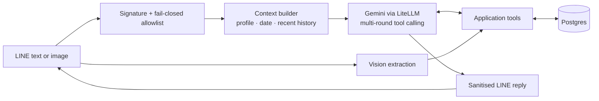
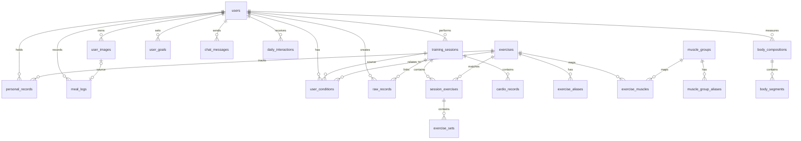

# FitnessMe

A personal fitness assistant for LINE. It turns free-form workout notes and
photos into structured training data, then makes that history queryable in the
same chat interface.

This is a personal production project and a reference implementation, not a
medical, coaching, or multi-tenant product.

## The problem

Workout records tend to be fragmented: informal notes use inconsistent names
and formats, personal records are easy to forget, and InBody reports require
manual transcription. A traditional form-based tracker only moves that
friction into another UI.

FitnessMe keeps the low-friction input—send a LINE message or image—while
making records structured enough to query later:

```text
深蹲 40kg*10*4
我上次深蹲多重？
今天自己練
```

## What it does

| Capability | Approach |
| --- | --- |
| Workout logging | An LLM maps free-form, bilingual text to structured tool calls. |
| PR tracking | Deterministic code calculates records and the next target. |
| History queries | Tools retrieve training, body-composition, meal, and image history scoped to one user. |
| Image extraction | A vision model classifies InBody reports and training sheets, then extracts structured fields. |
| Daily planning | A scheduled LINE push collects the user's plan and uses recent training, goals, and active conditions to suggest a session. |
| Reliability | Retry tiers and a rule-based fallback handle empty model responses; output sanitisation prevents tool-call scaffolding from reaching LINE. |

## Architecture



The model handles semantic work: interpreting free-form text, selecting tools,
and producing a helpful response. The application owns critical state and
business rules: identity checks, user scoping, date handling, import
idempotency, PR calculations, retention, and fallbacks.

## Engineering notes

- **Stack:** Python 3.12, FastAPI, SQLAlchemy async, LiteLLM, Gemini, LINE Messaging API, Supabase Postgres/Storage, Docker, and GitHub Actions.
- **Data isolation:** every data tool is scoped by `user_id`; the LINE allowlist is fail-closed, so an empty configuration admits nobody.
- **Auditability:** raw inputs that create records, tool calls, and model finish reasons are logged. Chat history has a shorter retention window than structured records.
- **Storage boundary:** photos live in the configured storage backend; Postgres stores metadata and storage keys only. Local and Supabase-backed implementations share one protocol.
- **Production lessons:** fuzzy lookup, explicit date anchoring, and layered fallbacks were added after real conversations surfaced false negatives, hallucinated records, and empty responses.

## Quick start

### Prerequisites

- Python 3.12
- [uv](https://docs.astral.sh/uv/)
- A LINE Messaging API channel and an LLM provider key for a working bot

### Run locally

```bash
uv sync
cp .env.example .env
# Fill in only the values needed for your local setup.
uv run uvicorn src.main:app --reload
```

The default development database is SQLite. The app creates tables and seeds
the exercise catalogue at startup. See [`.env.example`](.env.example) for all
configuration variables.

### Run tests

```bash
uv run pytest
```

### Useful commands

```bash
# Seed the exercise catalogue manually (normally done at startup).
uv run python -m scripts.seed

# Import a local history file after configuring an authorised LINE user.
uv run python -m scripts.import_history <LINE_USER_ID>
```

Historical-import input must follow
[`docs/import-template.txt`](docs/import-template.txt). Real workout records,
photos, databases, and environment files are intentionally excluded from the
repository.

## Repository layout

```text
src/
  auth/       LINE identity and allowlist checks
  db/         SQLAlchemy models and database setup
  line/       webhook and push-message integration
  llm/        prompts, model client, tools, and output sanitisation
  services/   workout, profile, image, scheduling, and admin workflows
  storage/    local and Supabase storage adapters
tests/        unit and integration-style tests
deploy/       Docker Compose and Caddy configuration
docs/         import-file template
```

## Deployment

The production setup uses Docker Compose with Caddy, Supabase, and GitHub
Actions. The workflow runs tests, builds an image, deploys it to a configured
host, and injects runtime configuration from GitHub Actions secrets. Do not
commit `.env`, databases, exported records, or images.

+## Appendix

<details>
<summary><strong>Data model</strong></summary>

The source of truth is [`src/db/models.py`](src/db/models.py). The database has
20 tables across identity, user state, training, body composition, interaction
logs, and the seeded exercise dictionary.



- `training_sessions` → `session_exercises` → `exercise_sets` captures a
  workout without flattening weight progressions.
- `personal_records` caches normalised best weights so PR replies do not need
  to recompute every historical set.
- `exercise_muscles` is the explicit many-to-many junction between exercises
  and muscle groups; `muscle_group_aliases` supports fuzzy muscle queries.
- Image bytes are stored outside Postgres; `user_images` retains only metadata
  and a storage key.
- Event dates represent the actual training or measurement day, rather than
  upload time.
- `raw_records`, `chat_messages`, and `daily_interactions` use different
  retention periods.

</details>

<details>
<summary><strong>Admin API</strong></summary>

Both endpoints require `X-API-Key` using `ADMIN_API_KEY`.

| Method | Path | Purpose |
| --- | --- | --- |
| `POST` | `/admin/import-history` | Import dated free-form records for one authorised LINE user. Returns `202` and processes in the background. |
| `POST` | `/admin/delete-records` | Delete training, cardio, body-composition, meal, and PR data in an inclusive date range. |

The history importer is idempotent per user and training date. Its file format
is documented in [`docs/import-template.txt`](docs/import-template.txt).

```bash
curl -X POST https://your-server.com/admin/import-history \
  -H "X-API-Key: $ADMIN_API_KEY" \
  -F "line_user_id=U..." \
  -F "file=@records.txt"

curl -X POST https://your-server.com/admin/delete-records \
  -H "X-API-Key: $ADMIN_API_KEY" \
  -H "Content-Type: application/json" \
  -d '{"line_user_id":"U...","start_date":"2025-05-12","end_date":"2025-05-14"}'
```

</details>

<details>
<summary><strong>Deployment and operations</strong></summary>

**Target stack:** GCP e2-micro, Docker Compose, Caddy, Supabase Postgres and
Storage, plus GitHub Actions. A push to `main` runs tests, builds and pushes an
image to GHCR, transfers Compose/Caddy configuration, writes runtime settings
from GitHub Actions secrets, then runs `docker compose pull && docker compose up -d`.

### One-time host bootstrap

On a new Ubuntu VM, install Docker Compose, add a 2 GB swap file (the e2-micro
has 1 GB RAM), and create the deployment directory:

```bash
sudo fallocate -l 2G /swapfile
sudo chmod 600 /swapfile && sudo mkswap /swapfile && sudo swapon /swapfile
echo '/swapfile none swap sw 0 0' | sudo tee -a /etc/fstab

# Install Docker Engine from Docker's official apt repository.
sudo apt update
sudo apt install -y ca-certificates curl
sudo install -m 0755 -d /etc/apt/keyrings
sudo curl -fsSL https://download.docker.com/linux/ubuntu/gpg -o /etc/apt/keyrings/docker.asc
sudo chmod a+r /etc/apt/keyrings/docker.asc
sudo tee /etc/apt/sources.list.d/docker.sources >/dev/null <<EOF
Types: deb
URIs: https://download.docker.com/linux/ubuntu
Suites: $(. /etc/os-release && echo "${UBUNTU_CODENAME:-$VERSION_CODENAME}")
Components: stable
Architectures: $(dpkg --print-architecture)
Signed-By: /etc/apt/keyrings/docker.asc
EOF

sudo apt update
sudo apt install -y docker-ce docker-ce-cli containerd.io docker-buildx-plugin docker-compose-plugin
sudo usermod -aG docker $USER  # Log out and back in before using Docker without sudo.
mkdir -p ~/fitness-me
```

Create a dedicated SSH key for GitHub Actions and add its public half to
`~/.ssh/authorized_keys`. Store the private half only in the `VM_SSH_KEY`
repository secret.

### Required GitHub Actions secrets

`VM_HOST`, `VM_USER`, `VM_SSH_KEY`, `LINE_CHANNEL_SECRET`,
`LINE_CHANNEL_ACCESS_TOKEN`, `LLM_PROVIDER`, `LLM_API_KEY`, `LLM_MODEL`,
`DATABASE_URL`, `STORAGE_PROVIDER`, `SUPABASE_URL`, `SUPABASE_SERVICE_KEY`,
`SUPABASE_BUCKET`, `ALLOWED_USER_IDS`, `ADMIN_API_KEY`, `ADMIN_LINE_USER_ID`,
`BASE_URL`, `TIMEZONE`, and `DOMAIN`.

`ALLOWED_USER_IDS` is intentionally fail-closed: an empty value allows no one
to invoke the bot. Use a stable hostname and point the LINE webhook at
`https://<your-domain>/webhook` after the first successful deployment.

### Day-2 operations

| Task | Command or action |
| --- | --- |
| Ship a change | Push to `main`. |
| Rotate a secret | Update the GitHub Action secret, then re-run the workflow. |
| Tail application logs | `ssh <vm> 'docker compose -f ~/fitness-me/docker-compose.yml logs -f app'` |
| Tail proxy logs | Use the same command with `caddy` in place of `app`. |
| Rebuild a VM | Repeat host bootstrap, update `VM_HOST` if needed, then re-run the workflow. |

</details>


## License

Source is available for viewing and evaluation only. See [LICENSE](LICENSE).
